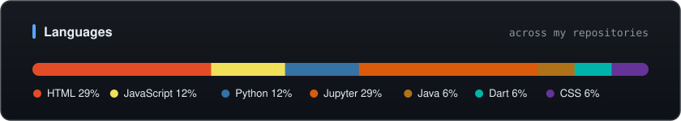

<!--
  Shehab Beram · GitHub profile README
  terminal.svg + impact.svg are auto-generated (scripts/ + .github/workflows/refresh.yml)
  Interactive terminal lives in /docs and is served on GitHub Pages.
-->

<!-- ░░ AUTO-PLAYING TERMINAL (click to run the live one) ░░ -->

this terminal is real. <a href="https://shehabov.github.io/Shehabov/" target="_blank" rel="noopener noreferrer"><b>click it to type your own commands</b></a> · auto generated daily by <code>scripts/gen_terminal.js</code>

  

# Shehab Beram
### `Forward Deployed Product Manager`

I ship product where the customer actually is, not from a spreadsheet three floors away.

<!-- ░░ PRIMARY CTAs ░░ -->

  

<!-- ░░ SIGNAL BADGES ░░ -->

  

<!-- ░░ REDIRECT BUTTONS ░░ -->

---

## 👋 About

---

## 🧰 Toolbox

**🎯 Product & Delivery**

**📊 Analytics & Insight**

**⚙️ Technical & AI**

**🧠 Ways of Working**

---

## 🗂️ Projects

<table>
<tr>
<td valign="top" width="25%">

### 🚀 Pre-AI Products
`2018 - 2022`

Products and apps I designed and shipped.

<a href="https://github.com/Shehabov/Heartly" target="_blank" rel="noopener noreferrer">Heartly</a> · heart-attack risk predictor
 <a href="https://github.com/Shehabov/omnifood-website" target="_blank" rel="noopener noreferrer">Omnifood</a> · food-subscription site
 <a href="https://github.com/Shehabov/Peer4u-Mobile-app" target="_blank" rel="noopener noreferrer">Peer4u</a> · peer-support mobile app
 <a href="https://github.com/Shehabov/Coindesk-dashboard" target="_blank" rel="noopener noreferrer">Coindesk Dashboard</a> · live crypto
 <a href="https://github.com/Shehabov/Satellite-Alert-System" target="_blank" rel="noopener noreferrer">Satellite Alert System</a>

Early web builds: <a href="https://github.com/Shehabov/Netflix-Website" target="_blank" rel="noopener noreferrer">Netflix</a>, <a href="https://github.com/Shehabov/Food-website-template" target="_blank" rel="noopener noreferrer">Food</a>, <a href="https://github.com/Shehabov/E-commerce--website" target="_blank" rel="noopener noreferrer">E-commerce</a>, <a href="https://github.com/Shehabov/The-Rose-Website" target="_blank" rel="noopener noreferrer">Rose</a>

</td>
<td valign="top" width="25%">

### 🧠 ML & Data
`2021 - Now`

Where I got my hands dirty with models.

<a href="https://github.com/Shehabov/Breast-Cancer-Detection" target="_blank" rel="noopener noreferrer">Breast Cancer Detection</a> ⭐ YOLOv8
 <a href="https://github.com/Shehabov/Resaurant-Review-Sentiment-Analysis" target="_blank" rel="noopener noreferrer">Review Sentiment Analysis</a>
 <a href="https://github.com/Shehabov/Movie-Genre-Classification" target="_blank" rel="noopener noreferrer">Movie Genre Classification</a>
 <a href="https://github.com/Shehabov/SMS-spam-detection" target="_blank" rel="noopener noreferrer">SMS Spam Detection</a>
 <a href="https://github.com/Shehabov/employee-attrition-prediction" target="_blank" rel="noopener noreferrer">Employee Attrition</a>

Foundations: <a href="https://github.com/Shehabov/Data-Structures-and-Algorithms-in-Python" target="_blank" rel="noopener noreferrer">DSA in Python</a>, <a href="https://github.com/Shehabov/Algorithms-implementation-in-Dart-programming-language" target="_blank" rel="noopener noreferrer">Algorithms in Dart</a>

</td>
<td valign="top" width="25%">

### ⚙️ AI Workflows
`n8n · 2024 - Now`

Automations that put AI to work.

<a href="https://github.com/Shehabov/competitor-intelligence-n8n" target="_blank" rel="noopener noreferrer">Competitor Intelligence</a>

Scrapes each competitor's site, LinkedIn, X, App Store and Capterra via Apify, analyzes with OpenAI, then emails a Google Doc + PDF. Weekly, on autopilot.

 

<b>◔ more shipping soon</b>

</td>
<td valign="top" width="25%">

### 🤖 AI-Era Live Products
`2023 - Now`

The next chapter, built AI-native.

 

<b>◔ Coming soon</b>

 

AI products with the model in the workflow, not bolted on for the demo. Currently building in the field. 🛠️

 

<a href="https://www.shehabberam.com/" target="_blank" rel="noopener noreferrer">Get the drop first →</a>

</td>
</tr>
</table>

---

## 📊 Stats & Signals

  

  

<!-- Contributions: isometric calendar (left) + snake (right), both auto-generated -->
<table>
<tr>
<td valign="top" width="50%"></td>
<td valign="top" width="50%"></td>
</tr>
</table>

Most of my product work lives off GitHub, so these stay calm. Both refresh daily.

---

### Let's build something worth deploying. 🚀

Terminal and impact card are hand-built animated SVGs, auto refreshed by GitHub Actions.

